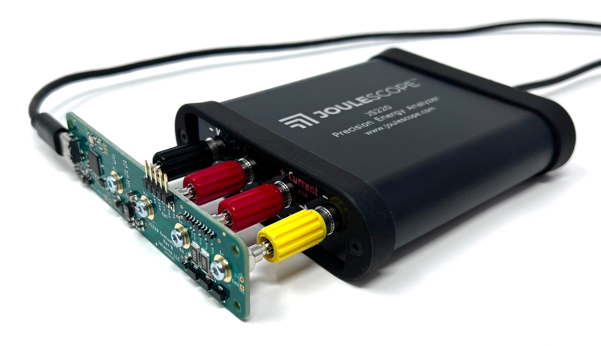

# JS220 Evaluation Kit 1

Welcome to the Joulescope JS220 Evaluation Kit 1 (EVK) project.  This EVK
provides a quick and easy way to get started measuring real waveforms with
your Joulescope.  The goal of the EVK is to toggle signals to vary the load.  
Your JS220 will measure this change and display the current waveform in the 
Joulescope UI. 

To get started, connect your JS220 to your host computer.  Install and
start the Joulescope UI.  Select View → Oscilloscope.  

Now plug the EVK into your JS220, like this:

Use the provided USB-C to USB-A cable to connect the EVK to your
host computer.  The Joulescope UI should display an interesting waveform,
like this:

The EVK hardware and firmware are open source and available on 
[GitHub](https://github.com/jetperch/js220_evk1).  View the 
[schematic]([GitHub](https://github.com/jetperch/js220_evk1/hardware/js220_evk1.pdf).

The EVK produces this waveform by default.  The EVK is also very flexible.
The EVK runs MicroPython for easy configuration and programming over a
USB-CDC serial port interface.

To get started with MicroPython on your EVK:

1. Connect the EVK to your host computer using the provided USB cable.
2. Install [Thonny](https://thonny.org/)
3. Launch Thonny
4. Select Run → Select interpretter...
   a. Select MicroPython (Raspberry Pi Pico)
   b. Leave port set to <Try to detect port automatically>
   c. OK
5. The "Shell" area at the bottom should display the MicroPython banner ">>>"

You can then run some other tests or create your own.

To stop any load sequence and return to a high impedance load:

    evk.stop()

To power off the supply:

    evk.power_off()

To disable both power and load:

    evk.off()

To run the demo again:

    evk.demo()

To run a simple descending pattern with the buck converter:

    evk.current_range_tester(use_buck=True)

To run a more complicated descending patterh with the buck converter:

    evk.off()
    evk.power_buck(0.6)
    evk.pio_start_sequence(frequency=10_000, sequence='descend')

To provide 1 V from the LDO into a 1 kΩ load:

    evk.off()
    evk.power_ldo(1.0)
    evk.resistance = 1000

To provide 3.3V from the buck converter into a load 1 kΩ || 10 µF:

    evk.off()
    evk.power_ldo(1.0)
    evk.resistance = 1000
    evk.c_10U.on()

To enable both the 1 kΩ and 100 Ω resistors with the 10 µF capacitor:

    evk.stop()
    evk.resistance_on(1000)
    evk.resistance_on(100)
    evk.c_10U.on()

Alternatively:

    evk.stop()
    evk.resistance_mask_on(0x0C)
    evk.c_10U.on()

To disconnect the 10 µF capacitor:
    
    evk.c_10U.off()

To use the PWM capacitor to drive a bipolar current:

    evk.off()
    evk.power_ldo(3.3)
    evk.c_pwm_start(10_000, 0x8000)

To change the LED color to blue:
    
    led.u8(red=0, green=0, blue=255)

You can also animate the LED:

    led.animate_fade([0x00ff00, 0, 0])
    led.animate_rainbow()
    led.stop()

## References:

* [MicroPython](https://micropython.org/)
  * [GitHub](https://github.com/micropython/micropython)
* [Thonny](https://thonny.org/)
* [MicroPython on Raspberry Pi](https://www.raspberrypi.com/documentation/microcontrollers/micropython.html)
  * [Raspberry Pi Pico Python SDK](https://datasheets.raspberrypi.com/pico/raspberry-pi-pico-python-sdk.pdf)
  * [API documentation](https://docs.micropython.org/en/latest/library/rp2.html)
  * [Pico Micropython Examples](https://github.com/raspberrypi/pico-micropython-examples/)
* [Raspberry Pi RP2040 Documentation](https://www.raspberrypi.com/documentation/microcontrollers/rp2040.html)
  * [Pico PIO Examples](https://github.com/raspberrypi/pico-examples/tree/master/pio)
  * [Pico Examples](https://github.com/raspberrypi/pico-examples) for C SDK
    * [Logic Analyzer](https://github.com/raspberrypi/pico-examples/blob/master/pio/logic_analyser/logic_analyser.c) PIO + DMA
    * [PIO](https://github.com/raspberrypi/pico-examples/tree/master/pio)
    * [DMA](https://github.com/raspberrypi/pico-examples/tree/master/dma)
* Controlling the EVK from your host computer
  * [pyboard.py](https://github.com/micropython/micropython/blob/master/tools/pyboard.py)
  * [rshell](https://github.com/dhylands/rshell)
  * [ampy](https://github.com/scientifichackers/ampy)
